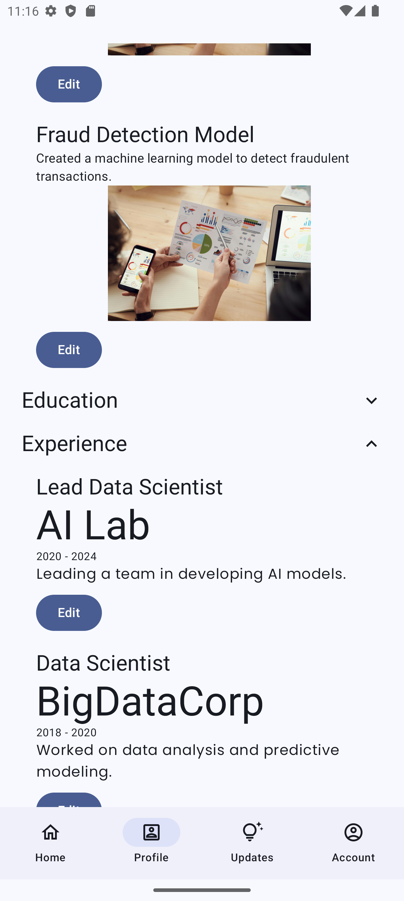

# SkillSnap Android App

SkillSnap is an open-source Android application designed to help users easily create and manage
their portfolios. The app provides a personalized portfolio with a unique URL, SEO-ready pages, and
user-controlled data. It supports both light and dark modes, making it visually appealing on any
device.

## Features

- 🌑 **Light & Dark Modes**: Choose between light and dark themes to match your style.
- 🚀 **SEO-Ready Portfolios**: Your portfolio will be optimized for search engines.
- 🔒 **User-Controlled Data**: Your data stays under your control, always.
- 🌐 **Cross-Platform Access**: View your portfolio on the web, with a unique URL.
- 🎨 **Customizable Profiles**: Update and manage your portfolio with ease.

## Screenshots

<table>
  <tr>
    <td></td>
    <td></td>
  </tr>
  <tr>
    <td></td>
    <td></td>
  </tr>
  <tr>
    <td></td>
    <td></td>
  </tr>
  <tr>
    <td></td>
    <td></td>
  </tr>
</table>

## Getting Started

1. **Clone the repo**: `git clone https://github.com/abdelillahbel/SkillSnapAndroid.git`
2. **Open in Android Studio**: Import the project into Android Studio.
3. **Build & Run**: Build the app and run it on your device or emulator.

## Contributing

Contributions are welcome! Please read the [CONTRIBUTING.md](CONTRIBUTING.md) file for more
information on how to contribute to this project.

## License

This project is licensed under the MIT License - see the [LICENSE](LICENSE) file for details.

## Contact

For any inquiries or feedback, feel free to reach out
to [@abdelillahbel](https://github.com/abdelillahbel) on GitHub.

*Copyright (c) 2024. DevUnion Foundation. All rights reserved.*
